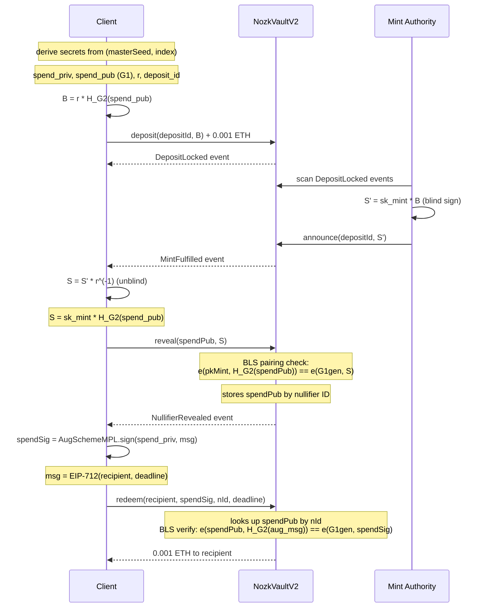
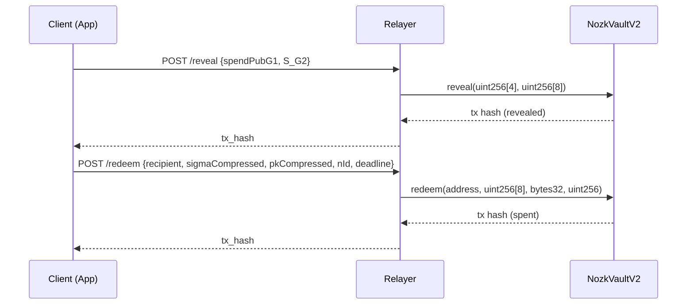

# NozKash Protocol Flow

Privacy-preserving eCash on EVM using BLS blind signatures over BLS12-381.

## Overview

NozKash uses blind signatures to break the on-chain link between depositor
and redeemer. The mint (a semi-trusted authority) signs blinded tokens without
learning which spend key they correspond to. The contract verifies BLS
pairings via EIP-2537 Pectra precompiles — no zero-knowledge proofs needed.

## Token Lifecycle

```
FRESH -> AWAITING_MINT -> READY_TO_REDEEM -> SPENT
```

Each token has a fixed denomination of 0.001 ETH. Every secret is
deterministically derived from `(masterSeed, index)`, enabling stateless
wallet recovery via chain scanning.

## Full Protocol Flow



### Key insight: spend pubkey storage

During `reveal()`, the contract stores the spend public key (G1 point,
4 x uint256) indexed by the nullifier ID. This is why `redeem()` does not
need the spend pubkey as a parameter — the contract looks it up from
the nullifier ID passed in the redeem call.

This two-phase approach (reveal then redeem) separates the BLS mint
signature verification from the spend authorization, allowing each step
to use a single pairing check.

## Relayer Flow

In the frontend app, a relayer submits transactions on behalf of the
user so the redeemer's wallet never appears on-chain:



The relayer is gas-only — it cannot forge spend signatures or redirect
funds. MEV protection is enforced by the BLS spend signature over an
EIP-712 message binding the recipient address and deadline.

## Aggregation

For batching multiple tokens in a single transaction:

- **`revealAggregated(spendPubs[], sigma)`** — batch reveal with a
  single pairing: `e(pkMint, sum(Y_i)) == e(G1gen, sigma)`
- **`redeemAggregated(recipient, sigma, nIds[], deadline)`** — batch
  redeem with (n+1)-pairing verification

## Cryptographic Primitives

| Primitive | Specification |
|-----------|---------------|
| Hash-to-G2 | RFC 9380 (SHA-256 + EIP-2537 MAP_FP2_TO_G2) |
| DST | `BLS_SIG_BLS12381G2_XMD:SHA-256_SSWU_RO_AUG_` |
| Spend signatures | BLS AugSchemeMPL (chia_rs / noble-curves) |
| Token derivation | `keccak256(seed \|\| index_be32)` with domain separation |
| Redeem message | EIP-712 typed structured data |
| G1 points | 4 x uint256 (EIP-2537 uncompressed, 128 bytes) |
| G2 points | 8 x uint256 (EIP-2537 uncompressed, 256 bytes) |
| Public key | G1 (mint authority) |
| Signatures | G2 (mint blind sig, spend sig) |

## Contract Entry Points

| Function | Parameters | Purpose |
|----------|-----------|---------|
| `deposit` | `address depositId, uint256[8] B` | Lock 0.001 ETH, register blinded G2 point |
| `announce` | `address depositId, uint256[8] S'` | Mint posts blind signature (G2) |
| `reveal` | `uint256[4] spendPub, uint256[8] S` | Reveal spend pubkey + unblinded sig, BLS pairing check |
| `redeem` | `address recipient, uint256[8] spendSig, bytes32 nId, uint256 deadline` | Verify BLS spend sig, transfer ETH |
| `refund` | `address depositId` | Reclaim ETH before announce |
| `revealAggregated` | `uint256[4][] spendPubs, uint256[8] sigma` | Batch reveal, single pairing |
| `redeemAggregated` | `address recipient, uint256[8] sigma, bytes32[] nIds, uint256 deadline` | Batch redeem, (n+1)-pairing |

---

> A rabbit taps code on the moonlit pane,
> Swaps curves, BN to BLS arcane.
> G1 the key, G2 the gleam,
> Vault V2 hums like a dream.
> Precompiles purr, nullifiers sing --
> Hop! Redeem -- privacy on wing.

*-- CodeRabbit, PR #13*
